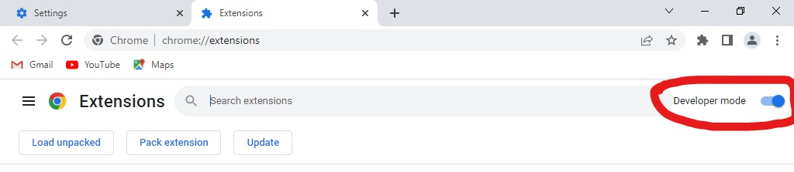
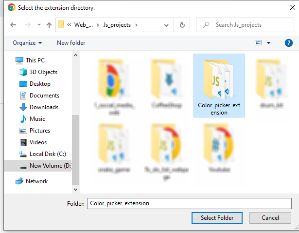

# ⭐ Color Picker Chrome Extension ⭐

This JavaScript application enables users to select colors from their screen using the EyeDropper API. It displays the picked colors in a list, allows copying color values to the clipboard, exports the colors as a text file, and provides functionality to clear all saved colors. The picked colors are stored in local storage to persist between sessions.

## 🚀 Installation Instructions

**Follow These Steps to Use This Extension:**

1. **Download or Clone the Repository**:
   - 📥 Download the `.zip` file from the repository and extract it to your local system.
   - 🖥️ Alternatively, clone the repository using Git:
     ```bash
     git clone https://github.com/RiyaHablani/color-picker-chrome-extension.git
     ```

2. **Open Browser**:
   - Open Google Chrome or Microsoft Edge on your computer.

3. **Navigate to Extensions**:
   - Open Chrome’s settings by clicking the three vertical dots (menu) in the top-right corner of the browser.
   - Select **"Extensions"** and **"Manage Extensions"** from the dropdown menu or go directly to `chrome://extensions/` in the address bar.

4. **Enable Developer Mode**:
   - In the Extensions tab, toggle the **"Developer mode"** switch in the top-right corner to turn it on.

5. **Load the Extension**:
   - Click the **"Load unpacked"** button.
   - Select the folder where you extracted or cloned the repository. This folder should contain the `manifest.json` file.

## 📸 Screenshots
1. **Turn on Developer mode**:

   

2. **Click on Load unpacked**:

   

3. **Select color-picker-chrome-extension folder**:

   


## 🔍 Verify Installation
- Check that the extension appears in the list of installed extensions and is functioning as expected.
- Enable This Extension (if Disabled).

## 🎨 Using the Extension
1. Open any tab other than the Google settings/home page.
2. Click on the Extension icon and select the color picker.
3. Press on "Pick Color", and move the cursor and click anywhere on the browser or on the desktop to pick a color.
4. You will get the HexCode of the chosen color.
5. Paste it anywhere to use the HexCode (already copied to the clipboard).

I hope this helps you get a specific Color HexCode from anywhere you want.

Always ready for any kind of Guidance/support and Help.

Thanks for Reading and Using this! 😊
